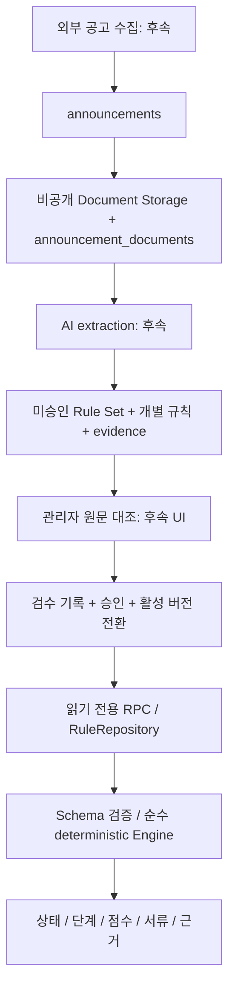

# 청약 맞춤판정 Rule DB 기반 구조

## 1. 범위와 현재 상태

기존 Expo Router / React Native 앱, Supabase JS 2.115.0 클라이언트, Supabase Auth 및 PostgreSQL을 재사용한다.
웹은 `vercel.json`의 Expo 정적 export 배포 구성을 유지한다. 기존 공고 수집은 `listings` Edge Function을 사용한다.
이번 읽기 경로는 기존 공개 anon key와 RLS를 사용하며 새 Edge Function이나 환경변수를 요구하지 않는다.
실제 프로젝트 schema에 migration을 적용하거나 서비스를 배포하지 않았다.

삼도이동 fixture는 **REFERENCE**다. 원문 HWP를 직접 확인하지 않았으므로 검토본 검증/공식 검증으로 승격하지 않았다.
관리번호 `2026000434` / `2026000435`의 지구 매핑도 등록하지 않았다.

## 2. 전체 pipeline



**사용자 판정에는 LLM과 원문 전체가 필요 없다.** 사용자의 프로필과 추가 입력은 기존처럼 로컬 엔진에만 전달한다.
규칙 조회 RPC에 개인정보를 전송하지 않는다.

## 3. DB schema

| Table | 역할 / 핵심 제약 |
| --- | --- |
| `announcements` | UUID canonical ID. `(source, external_id)` unique, 관리번호 nullable. DRAFT/PUBLISHED/ARCHIVED |
| `announcement_listing_bindings` | 기존 discovery listing ID → 공고 UUID 명시적 매핑. 이름 유사도/관리번호 추정 금지 |
| `announcement_documents` | 원문 metadata, SHA-256, Storage path, 원본/정정/검토본 상태. 내용 수정·삭제 금지 |
| `assessment_rule_sets` | 공고/문서별 version, source_status, schema_version, effective_date, 공개·활성·승인 상태 |
| `assessment_rules` | 개별 자격/단계 조건/점수 항목. supply_type, stage, category, rule_key는 column; 조건식과 배점표는 config JSONB |
| `rule_evidence` | 각 rule의 문서/section/table_label/label/page/excerpt/locator. 모르는 page는 null |
| `rule_extraction_jobs` | PENDING/PROCESSING/NEEDS_REVIEW/APPROVED/FAILED metadata. 실행 worker는 없음 |
| `assessment_admin_reviews` | append-only 검수 이력. NEEDS_REVIEW/APPROVED/REJECTED. 서버만 기록 |

전체 공고를 하나의 JSON으로 저장하지 않는다. Rule Set의 `config`에는 parameters와 순서 있는 **rule_key manifest**만 둔다.
manifest가 가리킨 규칙이 하나라도 없거나 중복되면 로딩 실패다. row 일부 누락이 자격 조건 생략으로 이어지지 않는다.
현재 category는 ELIGIBILITY/STAGE/SCORE. 증빙은 조건의 config.documents, REVIEW 처리 조건도 동일한 row로 표현한다.
향후 독립 tie-break/warning category가 필요하면 schema version을 올리고 decoder를 확장한다.

### Wire schema 1

```json
{
  "parameters": { "income.limit": 100 },
  "supplies": [{
    "type": "youth",
    "eligibility": ["youth.income"],
    "stages": [{ "stage": "GENERAL", "conditions": [], "scores": null }]
  }]
}
```

위 숫자는 구조 설명용이며 실제 공고 기준이 아니다.
`assessment_rules.config`는 조건이면 `{label, expression, documents, onFailure?}`, 점수면 `{label, fact, bands}`다.
`expression`은 all/any/eq/gte/lte만 허용한다. 함수, SQL, JavaScript 문자열을 실행하지 않는다.
stage 순서는 PRIORITY → GENERAL → LOTTERY, scores:null은 무가점, bands:null은 미검증이다.
schema 1은 rule당 evidence 한 건을 사용한다. DB는 다중 근거를 수용하지만 새 decoder 없이 여러 근거를 조용히 버리지 않는다.

## 4. Storage

비공개 `announcement-documents` bucket:

```text
{year}/{announcementUuid}/{documentUuid}/original.hwp
{year}/{announcementUuid}/{newDocumentUuid}/official.pdf
```

DB byte column에 파일을 저장하지 않는다. 업로드는 신뢰된 서버에서 `upsert:false`로 새 UUID path에 수행한다.
업로드 후 hash/size 검증, metadata 등록 순서를 사용한다. 실패한 orphan object 정리는 향후 서버 작업으로 분리한다.
문서 metadata는 append-only이며 새 파일/정정본은 새 document record다.
Storage API service role 자체는 삭제/덮어쓰기가 가능한 권한이므로, **향후 업로드 도구에서 immutable path 정책을 강제해야 한다**.
클라이언트에는 업로드/다운로드 정책을 열지 않는다. 기존의 광범위 Storage 정책이 있더라도 이 bucket을 제외하는 restrictive 정책을 추가한다.
공개 결과의 evidence에는 원문 section/table/page가 전달된다. 비공개 원문 열기/서명 URL 발급은 향후 별도 서버 권한 경로다.

## 5. 검증 상태와 lifecycle

| 상태 | 의미 |
| --- | --- |
| REFERENCE | 구조 또는 미검증 규칙. 엔진이 신청 가능/점수를 확정하지 않음 |
| DRAFT_SOURCE_VERIFIED | 제공된 검토본과 직접 대조 완료. 결과 warnings에 검토본 안내 한 번 |
| OFFICIAL_VERIFIED | 공식 원문과 직접 대조 완료. is_official 문서 필수 |

`source_status`와 **검수·공개 여부는 독립적**이다. 검토본도 검수 후 공개할 수 있고, 공식 규칙도 승인 전에는 비공개다.
AI extraction 성공 또는 job APPROVED 상태만으로 Rule Set을 활성화하지 않는다.

서버 등록 절차:

1. canonical 공고와 immutable 문서 등록; 정확한 listing ID만 별도 binding에 등록.
2. inactive/private/unapproved Rule Set 생성, rules와 evidence 삽입.
3. schema decoder 및 사례 테스트로 검증하고 사람이 원문을 대조.
4. 검수 기록을 append한 뒤 `approved_at` 설정. 원문 상태를 임의 승격하지 않는다.
5. 하나의 transaction에서 기존 set을 inactive로, 새 set을 public/active로 변경.

공고당 active Rule Set은 partial unique index로 하나만 허용한다.
승인 후 내용, 출처 상태, 기준일, rule/evidence는 변경할 수 없다. 수정/공식본 승격/정정은 새 버전을 만든다.
활성/공개 플래그만 바꿀 수 있어 잘못된 버전은 즉시 비공개하거나 이전 승인 버전을 재활성화할 수 있다.
DB는 내용의 법적 정확성을 검증하지 않으며, 현재 관리자 인증 체계가 없으므로 클라이언트 admin 권한을 만들지 않았다.
검수 도구가 추가될 때 reviewer identity 인증과 승인 transaction을 서버에서 강제해야 한다.

## 6. Runtime과 repository

- `AssessmentRuleRepository.getActiveRuleSet({announcementId})` 또는 `{listingId}`
- `StaticAssessmentRuleRepository`: 기존 테스트와 명시적 삼도이동 reference 선택만 담당.
- `DatabaseAssessmentRuleRepository`: transport 주입, 검증, 오류 분리.
- `createSupabaseRuleRepository`: 기존 Supabase client로 RPC 호출, 15초 timeout.
- `read_assessment_rule_set`: 선택한 공고의 active/public/approved 버전 + 규칙 + 근거를 **한 SQL statement의 snapshot**으로 반환.
- `list_assessment_announcements`: 선택 카드용 metadata만 51개 조회(50개 표시 + 다음 페이지 판별), UUID keyset pagination.
- `useAssessmentRules`: 선택 변경/재시도 시 이전 응답 폐기. 이전 공고 규칙으로 새 공고를 계산하지 않음.

DB → domain 변환 시 공고/목록 binding, schema, source status, 공급유형, 순서, 규칙 완전성, expression, fact,
parameter, 점수 구간, evidence/document 일치, 날짜, payload 크기를 검증한다.
RULE_NOT_AVAILABLE / SERVICE_UNAVAILABLE / INVALID_RULE_SET / UNSUPPORTED_SCHEMA를 구분한다.
어떤 오류도 static fallback을 일으키지 않는다. 결과 화면까지 진행하기 전에 조회 실패를 보여준다.

홈에서 DB 공고 metadata를 선택하거나 상세 CTA로 listing ID를 전달한다. 상세 CTA는 읽을 수 있는 규칙이 있을 때만 표시한다.
실제 데이터가 없는 공고는 기존 “준비 중” 표시를 유지한다. 개인정보 질문/validation timing/프로필 수정/결과 CTA는 보존한다.
클라이언트 장기 cache는 없고 화면 진입 시 최신 활성 버전을 조회한다. 진행 중 판정은 가져온 불변 버전 snapshot으로 계산한다.
새 공고가 지원되는 schema/fact/supply 범위라면 **DB 등록·승인만으로 재배포 없이** 다음 조회부터 반영된다.
현재 질문 UI와 fact는 기존 MVP 범위다. 새로운 법적 산식/공급유형/질문이 필요하면 schema 및 클라이언트 기능 확장이 필요하다.
신생아/일반/기관추천을 DB key로 저장할 수 있지만 schema 1 엔진이 지원한다고 가장하지 않는다.

## 7. 과거 판정 추적

결과에 `rulesId`(DB UUID), `rulesVersion`, `provenance.announcementId/documentId/schemaVersion`, `sourceStatus`, listingId와 evidence ID를 보존한다.
현재 결과 저장 테이블은 만들지 않았다. 향후 판정 기록 저장 시 이 식별자와 입력 snapshot 또는 사용자 동의에 따른 최소 입력을 함께 저장한다.
비활성 버전은 일반 사용자가 조회할 수 없다. 과거 판정 재현은 인증된 서버의 별도 접근 정책이 필요하다.

## 8. 보안

모든 새 public table에 RLS, anon/authenticated 쓰기 권한 revoke, 필요한 table의 SELECT만 grant.
active/public/approved 및 PUBLISHED 공고 조건이 RLS에도 적용된다. child rule/evidence는 부모 접근권한을 따른다.
검수/추출 job은 클라이언트 SELECT도 없다. RPC는 SECURITY INVOKER와 빈 search_path를 사용하며 RLS를 우회하지 않는다.
service role은 서버 전용이다. 클라이언트의 기존 EXPO_PUBLIC_SUPABASE_ANON_KEY 외 새 key를 추가하지 않는다.
참고: [Supabase RLS](https://supabase.com/docs/guides/database/postgres/row-level-security), [Storage access control](https://supabase.com/docs/guides/storage/security/access-control).

## 9. Seed / fixture import

자동 seed나 운영 데이터를 migration에 포함하지 않는다. `serializeRuleSet`은 inactive/private/unapproved payload만 만든다.
legacy `verification:VERIFIED`만으로 출처 상태를 승격하지 않는다. sourceStatus가 없으면 항상 REFERENCE로 export한다.

```powershell
npm run export:assessment-reference -- .cache/samdo-reference.json
```

UTF-8 파일 생성만 수행하며 기존 파일을 덮어쓰지 않는다. 실제 관리번호 binding은 포함하지 않는다.
서버 import 도구는 payload.rule_set을 삽입한 뒤, payload.rules의 각 row를 삽입하고 반환된 rule UUID로 evidence를 삽입해야 한다.
동일 transaction에서 rule_key manifest의 완전성을 검사하고 실패 시 rollback한다. 현재 실제 import writer/승인 API는 후속 범위다.
이 구조는 AI extractor도 같은 JSON 계약을 출력하도록 만들 수 있다. AI 결과는 **미승인 상태에서만** 저장한다.

## 10. Migration 적용과 rollback

`supabase/migrations/20260915105910_assessment_rule_registry.sql`은 새 table/index/function/policy/private bucket만 추가한다.
기존 profile/listing cache/auth table은 수정하지 않는다. 배포 전에 staging에 적용하고 Supabase lint/RLS 통합검사를 수행한다.
적용 순서: DB migration → 서버에서 검수된 버전 등록 → 클라이언트 배포. 클라이언트가 먼저 배포돼 RPC가 없으면 명시적 조회 실패 상태다.
안전한 rollback은 해당 rule set의 is_public/is_active를 false로 바꾸고 필요하면 이전 클라이언트로 되돌리는 방식이다.
문서·판정 재현 자료를 보존해야 하므로 DROP/down migration을 제공하지 않는다.

## 11. 검증

```powershell
npm run typecheck
npm run test:assessment
npm test
npx expo export --platform web
git diff --check
```

테스트 전용 PostgreSQL WASM runtime(앱 dependency가 아니며 ignored .cache에 설치):

```powershell
npm install --prefix .cache/assessment-sql-check --no-save --package-lock=false @electric-sql/pglite@0.5.8
npm run test:assessment-db
```

이 검사는 실제 migration SQL과 RLS/trigger를 실행한다. Supabase 인프라 role/storage table은 최소 stand-in이다.
운영 DB 연결 없이 승인·불변성·활성 버전·anon/authenticated read/write·Storage 제한과 실제 RPC→decoder 왕복을 검증한다.
Supabase 자체 Storage API 및 PostgREST 검증을 대체하지 않는다.
로컬 Supabase가 실행 중이면 `npx --yes supabase db lint --local --fail-on warning`도 실행한다.
현재 환경의 로컬 DB는 연결되지 않아 CLI lint는 실행 완료하지 못했다.

Chrome 390×844에서 export 화면의 목록/RPC 조회 실패, 재시도 노출, 진행 버튼 비활성화,
명시적 삼도이동 reference 선택 → 기존 프로필 확인 단계 진입을 확인했다.
운영 migration 미적용 상태이므로 브라우저에서 실제 DB 공고 성공 판정은 검증하지 않았다.
DB 성공 경로는 격리 SQL RPC → decoder → engine 테스트로 검증한다.

### 이번 구현의 실행 기록

- 시작: `feature/application-assessment-v1`, HEAD `d82b8e8`, working tree clean.
- 작업: `feature/assessment-rule-db`; 기존 `a3f31da`, `d82b8e8` 보존.
- `npm run typecheck`: 통과.
- assessment: 기존 23 + 신규 23 = 46개 통과.
- `npm test`: 전체 통과, 기존 Deno Edge 65개 검사 포함.
- 격리 SQL/RLS: 111개 검사 통과.
- Expo web export: 26개 경로 생성 성공.
- fixture UTF-8 export 및 `git diff --check`: 통과.
- 운영 DB migration 적용, 원문 업로드, 배포, git push는 수행하지 않음.

## 12. 비용 / 토큰 / 후속 자동화

- 문서 SHA-256 + extractor schema + prompt version을 중복 추출 방지 키로 활용한다.
- 최초 등록/정정본 등록 때만 원문 extraction을 수행한다. 사용자 판정 횟수만큼 원문을 재전송하지 않는다.
- 사용자 설명에 LLM을 추가하더라도 계산 결과와 관련된 rule/evidence 일부만 context로 전달한다. 판정은 엔진이 확정한다.
- 후속 순서: staging 검증 → 검수된 1건 import 도구 → 관리자 인증/검수 workflow → 문서 수집/Storage uploader → extraction worker/재시도/관측.
- 이번에 crawler, AI extraction, 관리자 UI/CMS, 자동 승인, RAG/vector DB, fine-tuning은 구현하지 않았다.
